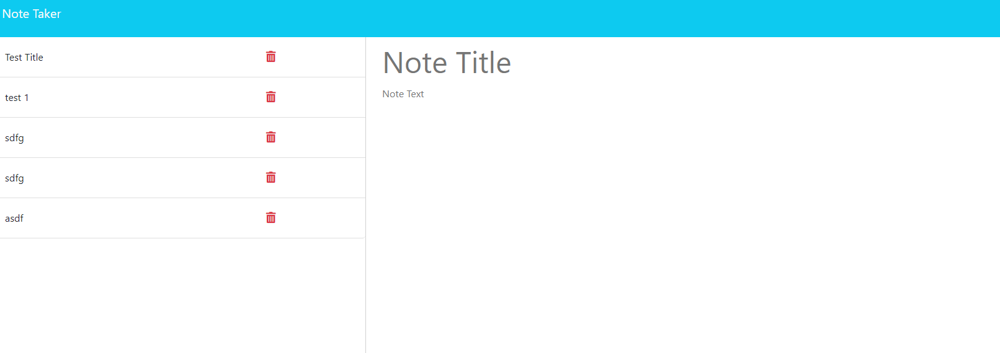

# Note Taker

  
  ## Table of contents

  [Description](#Description)

  [Installation](#Installation)

  [Usage](#Usage)

  [Contribution](#Contribution)
  
  [Tests](#Tests)

  [License](#License)

  [Questions](#Questions)

  ## Description 

  Allows a user to make notes using a rest api.

  ## Installation 

  after cloning the repo run npm i in an intergrated terminal

  ## Usage 

  Make sure to spell things correctly as there is no spellcheck currently!

  ## Contribution 

  Any contributions are welcome!

  ## Tests  

  After installing simply run node server in an intergrated terminal.

  ## License 

  N/A

  ## Questions 

  I am on github at [UtuRaiden](https://github.com/UtuRaiden)

  Or my email is barronpeterson56@gmail.com

  ## Screenshot

  

 

  
